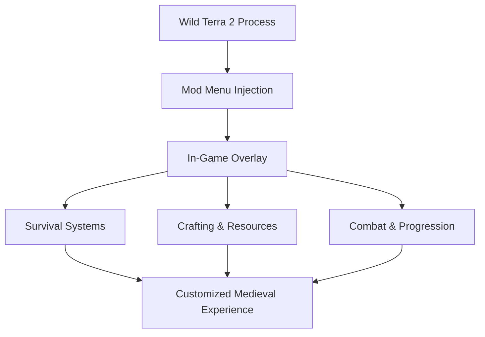

# Wild Terra 2: New Lands Mod Menu

Wild Terra 2: New Lands is a land that owes you nothing.
Every tree demands effort. Every wound remembers you. Progress is slow because survival is meant to be *earned*.

**Wild Terra 2: New Lands Mod Menu** doesn’t betray that truth.
It gives you a **lever beside it**.

A quiet overlay where you decide how sharp the edges of survival should be — today.


---

## 🌍 Overview

The Mod Menu is a **persistent in-game overlay** that stays active throughout your session, allowing real-time adjustments to survival systems, crafting pressure, combat difficulty, and progression pace. Unlike basic trainers, this menu is always within reach — sliders instead of shortcuts, control instead of extremes.

Some evenings you endure the world as designed.
Other evenings, you *study it*.

Both are honest ways to survive.

---

## 🧩 Mod Menu Features

### ❤️ Survival & Vitality

* God Mode toggle
* Infinite health
* Infinite stamina
* Disable hunger and thirst
* Prevent fatal damage

### 🪓 Crafting & Resources

* Free crafting (no materials required)
* Instant crafting completion
* Tool durability lock
* Resource consumption scaling

### ⚔ Combat & Exploration

* Damage multiplier (adjustable)
* Enemy damage reduction
* Movement speed control
* Safe exploration mode

### ⏳ World & Progression

* Time control (pause / slow / speed)
* XP gain multiplier
* Faster skill leveling
* Fatigue system override

[!NOTE]
Each system is independent. You can soften fatigue while keeping combat unforgiving — balance is always yours.

---

## ⚡ How It Feels to Use

1. Launch Wild Terra 2: New Lands
2. Inject the Mod Menu
3. Open the overlay with a hotkey
4. Toggle or fine-tune systems live
5. Continue playing without interruption

Example “system study” setup:

```text
• Infinite stamina
• No hunger
• Normal combat damage
• Free crafting
→ Learn mechanics without constant resets
```

[!IMPORTANT]
On first playthroughs, avoid disabling too many survival layers — the game’s identity lives in resistance.

---

## 🔁 Survival Control Flow



Immediate feedback. Thoughtful control. No immersion breaks.

---

## ❓ FAQ

**How is this different from a trainer?**
A Mod Menu stays visible with sliders and live tuning, not just hotkeys.

**Can I adjust settings during combat?**
Yes — all changes apply instantly.

**Will this affect my save files?**
No. Modifications exist only while the game is running.

**Is it useful for beginners?**
Very. It allows learning systems without punishing loops.

**Does it remove difficulty entirely?**
Only if you choose that route.

---

## 🌘 Final Thoughts

Wild Terra 2 is about patience.
About failing slowly, learning quietly, and surviving honestly.

This Mod Menu doesn’t make you stronger than the land.
It lets you *decide how loudly the land speaks*.

Adjust the weight.
Walk the roads longer.
And let mastery arrive through understanding — not exhaustion.

---
