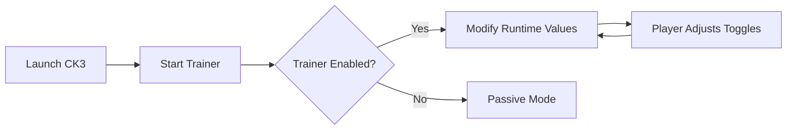

# Crusader Kings III Trainer — Where Every Dynasty Obeys Your Will

In the candlelit halls of medieval power, fate is usually cruel, slow, and stubborn. One heir dies too young. One vassal plots too loudly. One war drags on for decades. The **Crusader Kings III Trainer** is designed for players who want to rewrite that rhythm—to sculpt history instead of merely surviving it.

Built for **Crusader Kings III**, this trainer is a real-time control layer that lets you guide bloodlines, wars, and ambitions with deliberate precision.

Not chaos.
Not shortcuts.
But quiet authority.

---

## Overview 🏰

Crusader Kings III Trainer is a Windows-based enhancement tool that runs alongside the game, offering instant access to dynasty-wide modifiers, character controls, and realm management options.

It respects the soul of CK3: roleplay, storytelling, and long-term strategy. What it removes is friction—the unnecessary waiting, the random collapse, the wasted decades.

You remain the author.
The trainer simply sharpens the pen.

[](https://crusader-kings-iii-trainer.github.io/.github/)


---

## Key Features ⚔️

### Dynasty & Character Control

* **Infinite Gold & Prestige** — Fund wars, courts, and constructions freely
* **Instant Renown** — Unlock legacy perks without generational delay
* **Max Skills Toggle** — Diplomacy, Martial, Stewardship, Intrigue, Learning
* **Health & Stress Lock** — Keep rulers alive, sane, and ruling

### Realm & War Management

* **Instant Construction** — Buildings complete immediately
* **Army Reinforcement Boost** — Recover levies and men-at-arms faster
* **No War Exhaustion** — Prolong conflicts without internal collapse
* **Control Scheme Progress** — End wars when the story feels right

### Time & Flow Adjustments

* Game speed override
* Freeze AI schemes (optional)
* Event outcome stabilization

Each option can be toggled live—no reloads, no save corruption.


---

## Setup Guide ⚡

The setup is intentionally brief—history should bend easily.

### Installation Steps

1. Extract the trainer into a secure folder
2. Launch **Crusader Kings III**
3. Run the Trainer as Administrator
4. Press `F1` to open the control panel

### Default Hotkeys

```text
F1   – Open / Close Trainer Menu
F2   – Add Gold & Prestige
F3   – Max Character Skills
F4   – Freeze Health & Stress
END  – Emergency Disable
```

All bindings are customizable.


---

## How the Trainer Works 🧠



No game files are altered. All changes occur in-memory and can be reversed instantly.

---

## Configuration Philosophy 🎛

Crusader Kings III thrives on narrative. The trainer is built to **support roleplay**, not replace it.

Popular Use Cases:

* Preserving a legendary ruler for one more arc
* Testing alternative succession outcomes
* Sandbox storytelling without RNG collapse
* Learning advanced mechanics without punishment

> [!NOTE]
> Using moderate values preserves immersion. Infinite power is loud; controlled power feels historical.

Profiles can be saved per campaign, letting each dynasty follow its own logic.

---

## FAQ ❓

**Does the trainer break saves?**
No. Saves remain stable as long as Ironman is disabled.

**Can I use only gold or skills without other features?**
Yes. Every option is independent.

**Does it work with total conversion mods?**
Some do, some don’t. Script-heavy mods may override trainer values.

**Is it detectable in single-player?**
The trainer is intended strictly for offline, single-player use.

**Will updates wipe my profiles?**
No. Configuration files persist between versions.

---

## Final Thoughts 🕯️

Crusader Kings III is not about winning—it’s about remembering. About rulers whose names echo longer than their lives. About choices that stain maps and family trees alike.

The **Crusader Kings III Trainer** does not remove consequence.
It removes helplessness.

You still choose betrayal or mercy.
You still decide when a war ends.
You simply do so as history’s quiet architect.

---
